# Лабораторная работа №1. Проектирование и разработка информационных систем

## 1. Теория

### 1.1. Общая логика выполнения модуля

Модуль 1 предполагает разработку учебной информационной системы по заданной предметной области. Важно соблюдать правильный порядок действий:

1. сначала проектируется и создаётся база данных;
2. затем реализуется минимально необходимый интерфейс;
3. после этого добавляется серверная логика (бэкенд) и связь с БД;
4. результаты фиксируются в репозитории системы контроля версий.

Ключевой принцип: делаем только то, что нужно для функционала подсистемы, а не пытаемся смоделировать “всю предметную область целиком”.

---

### 1.2. Проектирование базы данных как первый этап

Разработку приложения необходимо начинать с проектирования и создания базы данных.

На этом этапе нет необходимости воспроизводить все сущности предметной области — достаточно создать:

* таблицы;
* поля с подходящими типами данных;
* связи, непосредственно относящиеся к разрабатываемой подсистеме и её функционалу.

Также требуется:

* обязательно создать ER-диаграмму средствами СУБД;
* обеспечить корректные PK / FK;
* определить кратности связей;
* привести структуру к 3НФ (третья нормальная форма), чтобы не было дублирования данных и аномалий.

---

### 1.3. Полный стек технологий (Full Stack)

Информационная система должна быть выполнена с применением полного стека технологий, то есть в проекте должны присутствовать:

* фронтенд (страницы интерфейса пользователя);
* бэкенд (серверная логика, маршруты, обработка запросов);
* база данных (таблицы, связи, справочники);
* объектно-ориентированное программирование (структура кода, функции/классы, логика);
* подключаемые библиотеки и фреймворки.

То есть нельзя ограничиваться только HTML-страницами или только базой данных — требуется рабочая связка UI → API → DB.

---

### 1.4. Репозиторий и контроль версий как обязательное требование

Все практические результаты должны быть переданы путём загрузки файлов в индивидуальный репозиторий системы контроля версий.

Обязательно:

* вести проект в репозитории;
* выполнять коммиты как минимум:

  * в начале выполнения модуля;
  * в завершении выполнения модуля.

Это подтверждает этапность работы и наличие результата.

---

### 1.5. Особенности выполнения в условиях ГЭ (экзамена)

В условиях ГЭ действуют организационные ограничения:

1. Интернет на рабочих местах участников недоступен.
2. Для справки используется офлайн-справочник, доступный на площадке.
3. Используется общий сервер для:

   * базы данных;
   * бэкенда;
   * хранения и проверки работ участников;
   * создания индивидуальных репозиториев.
4. Допускается предоставление актуальных библиотек и фреймворков без подключения к интернету — заранее подготовленных и размещённых в публичной папке сервера (доступной на чтение всем участникам экзамена).
5. Медиафайлы (приложения к заданию) также размещаются в публичной папке сервера.
6. Взаимодействие с базой данных участник проверяет в подготовительный день;

   * в день экзамена участник проектирует базу данных самостоятельно.

---

### 1.6. Описание предметной области (что разрабатываем)

Портал «Корочки.есть» — информационная система для записи на онлайн-курсы дополнительного профессионального образования.

Перед началом использования портала пользователю необходимо пройти процедуру регистрации.

После входа в систему пользователь может:

* составить заявку на обучение по программе дополнительного профессионального образования;
* указать наименование курса;
* выбрать желаемое время начала обучения;
* указать способ оплаты курса.

Все заявки пользователей хранятся в базе данных.

После подачи заявки она поступает на рассмотрение администратору, который проверяет корректность введённых данных и может изменить статус заявки.

---

### 1.7. Основной функционал системы

По заданию реализуются следующие страницы и сценарии:

1. Страница регистрации

    * логин (латиница и цифры, не менее 6 символов);
    * пароль (не менее 8 символов);
    * ФИО (кириллица и пробелы);
    * телефон (`8(XXX)XXX-XX-XX`);
    * email (формат электронной почты).
    Все поля обязательны. Кнопка «Создать пользователя» заносит данные в БД.

2. Страница авторизации

    * ввод логина и пароля;
    * ошибки при неверном вводе;
    * переходы между регистрацией и авторизацией:

        * «Еще не зарегистрированы? Регистрация»
        * «Уже зарегистрированы? Войти»

3. Страница просмотра заявок

    * просмотр ранее оставленных заявок (для авторизованного пользователя);
    * возможность оставить отзыв о качестве образовательных услуг.

4. Страница формирования заявки
   Пользователь указывает:

    * наименование курса;
    * желаемую дату начала обучения;
    * способ оплаты:

        * наличными;
        * переводом по номеру телефона.
            После нажатия «Отправить» заявка сохраняется в БД и направляется администратору.

5. Панель администратора
   Доступ:

    * логин: `Admin`
    * пароль: `KorokNET`

Админ видит все заявки пользователей и может менять статусы:

   * «Новая»
   * «Идёт обучение»
   * «Обучение завершено»

---

## 2. Задание

### 2.1. Общие требования к выполнению

1. Начать разработку приложения с проектирования и создания базы данных.
2. Создать только минимально необходимые сущности и связи, относящиеся к функционалу подсистемы.
3. Обязательно создать ER-диаграмму средствами СУБД.
4. Реализовать минимально необходимый интерфейс (страницы по заданию).
5. Реализовать связку полного стека технологий (frontend + backend + DB + ООП + библиотеки).
6. Все результаты загрузить в индивидуальный репозиторий и сделать минимум два коммита: стартовый и финальный.

---

### 2.2. Предметная область для реализации

Система: Портал “Корочки.есть” (запись на онлайн-курсы).

Нужно обеспечить:

* регистрацию пользователя;
* авторизацию;
* формирование заявок;
* просмотр заявок;
* отзывы;
* панель администратора со сменой статуса заявок.

---

### 2.3. Для выполнения требуется

1. Шаблон отчёта, указанный в описании лабораторной работы.
2. Вариант задания, закреплённый за студентом на семестр и опубликованный в ЛМС.
3. Требования к оформлению — согласно методическим указаниям в ЛМС или соответствующему разделу документации.
4. Для построения диаграмм использовать draw.io (diagrams.net) (или ER-Designer в СУБД по заданию).
5. Для разработки БД и тестирования использовать окружение (в примере): XAMPP (Apache + MySQL + PHP + FTP).

---

### 2.4. Необходимые приложения

* `Прил_ОЗ_КОД 09.02.07-3-2026-М1.zip`

👉 [Приложение к модулю 1](../assets/files//Прил_ОЗ_КОД%2009.02.07-3-2026-М1.zip)

---

### 2.5. Запрет

❗ Запрещается использование систем искусственного интеллекта для выполнения работы.

Работы, выполненные с использованием ИИ, полностью или частично скопированные, а также не сданные, оцениваются в 0 баллов без возможности доработки.

---

## 3. Решение — Пошаговое выполнение заданияы

## 1. Инструкция: работа с индивидуальным репозиторием и коммитами

### 1.1. Создание индивидуального репозитория

1. В 0 день будет возможность ознакомится с системой контроля версии Git установленной на площадке.
2. Откройте систему контроля версий, используемую в учебном процессе (Git).
3. Создайте новый репозиторий для выполнения модуля.
4. Укажите название репозитория (например, по теме модуля или проекту).
5. Убедитесь, что репозиторий создан индивидуально и доступен для проверки преподавателем/экзаменатором.

---

### 1.2. Первый коммит в начале работы

1. Склонируйте созданный репозиторий на рабочий компьютер.
2. Создайте базовую структуру проекта (папки и/или файлы).
3. Добавьте изменения в индекс:

```bash
git add .
```

4. Выполните первый коммит:

```bash
git commit -m "Начало работы над модулем 1"
```

5. Отправьте изменения в репозиторий:

```bash
git push
```

---

### 1.3. Финальный коммит в конце работы

1. Убедитесь, что в репозитории присутствуют все файлы проекта:

* исходные коды;
* файлы базы данных;
* ER-диаграмма;
* вспомогательные материалы (если предусмотрены заданием).

2. Узнать статус созданных/измененных файлов

```bash
git status
```

3. Добавьте все изменения:

```bash
git add .
```

4. Выполните финальный коммит:

```bash
git commit -m "Завершение выполнения модуля 1"
```

5. Отправьте финальный коммит в репозиторий:

```bash
git push
```

После выполнения этих шагов репозиторий считается готовым к проверке.

---

## 2. Проектирование и создание базы данных

> Для выполнения используется XAMPP (Apache + MySQL + PHP + FTP)

### 2.1. Описание задания

1. Спроектировать минимально необходимые сущности для функционала:

* пользователи (регистрация/вход);
* заявки на обучение;

2. Создать в СУБД:

* таблицы;
* поля с подходящими типами данных;
* связи между таблицами, относящиеся к функционалу.

3. Обязательно сделать ER-диаграмму средствами СУБД и сохранить её (экспорт/скриншот).

---

### 2.2. Инструкция по выполнению задания

#### 2.2.1. Запуск окружения XAMPP

1. Запустите XAMPP Control Panel.
2. Нажмите Start для модулей:

* Apache
* MySQL

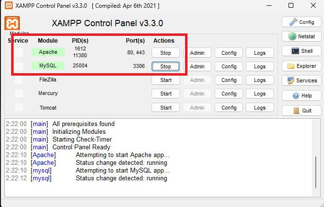
///caption
Рисунок 1 - Запуск программы
///

3. Откройте в браузере:

* `http://localhost/phpmyadmin`

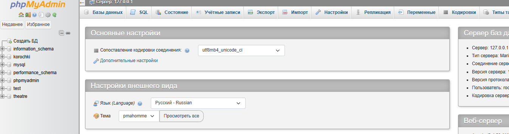
///caption
Рисунок 2 - Phpmyadmin
///

---

#### 2.2.2. Создание базы данных

1. В phpMyAdmin откройте вкладку Базы данных.
2. В поле Создать базу данных введите имя, например: `korochki`.
3. Выберите кодировку utf8mb4_general_ci.
4. Нажмите Создать.


///caption
Рисунок 3 - Создание базы данных
///

---

#### 2.2.3. Проектирование минимальных сущностей (по схеме БД)

По заданию используются основные сущности и справочники (3НФ):

* Пользователи `users` — регистрация/авторизация.
* Заявки `applications` — создание и хранение заявок пользователя.
* Справочники:

  * `roles` — роли пользователей (user/admin);
  * `payment_methods` — способы оплаты;
  * `application_statuses` — статусы заявок.
* Отзывы `reviews` — хранение отзывов пользователей.

---

#### 2.2.4. Создание таблицы ролей (roles)

1. Откройте базу `korochki`.
2. Нажмите Создать таблицу.
3. Имя таблицы: `roles`, количество столбцов: 2 → Вперёд.


///caption
Рисунок 4 - Создание таблицы ролей
///

4. Создайте поля:

| Поле   | Тип         | Атрибуты                    |
| ------ | ----------- | --------------------------- |
| `id`   | INT         | PRIMARY KEY, AUTO_INCREMENT |
| `name` | VARCHAR(30) | NOT NULL, UNIQUE            |

5. Нажмите Сохранить.

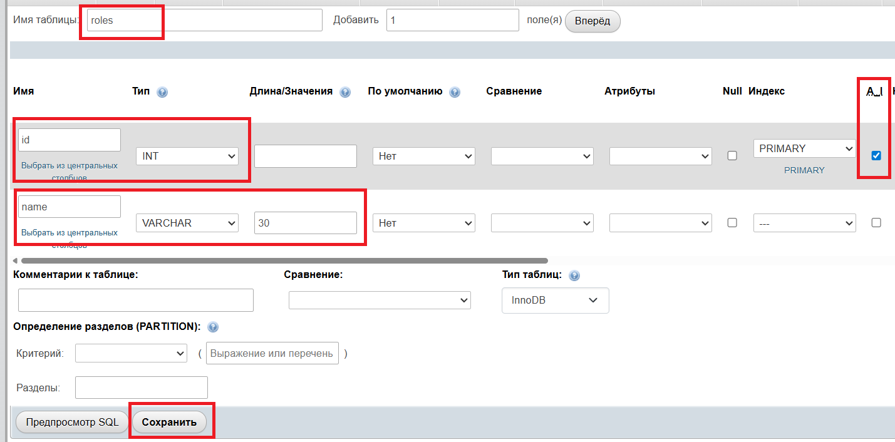
///caption
Рисунок 5 - Создание полей
///

---

#### 2.2.5. Создание таблицы пользователей (users)

1. В базе `korochki` нажмите Создать таблицу.
2. Имя таблицы: `users`, количество столбцов: 8 → Вперёд.
3. Создайте поля:

| Поле            | Тип          | Атрибуты                    |
| --------------- | ------------ | --------------------------- |
| `id`            | INT          | PRIMARY KEY, AUTO_INCREMENT |
| `login`         | VARCHAR(50)  | NOT NULL, UNIQUE            |
| `password_hash` | VARCHAR(255) | NOT NULL                    |
| `full_name`     | VARCHAR(200) | NOT NULL                    |
| `phone`         | VARCHAR(20)  | NOT NULL                    |
| `email`         | VARCHAR(120) | NOT NULL, UNIQUE            |
| `role_id`       | INT          | NOT NULL                    |
| `created_at`    | TIMESTAMP    | DEFAULT CURRENT_TIMESTAMP   |

4. Нажмите Сохранить.


///caption
Рисунок 6 - Создание таблицы пользователей
///

---

#### 2.2.6. Создание таблицы способов оплаты (payment_methods)

1. В базе `korochki` нажмите Создать таблицу.
2. Имя таблицы: `payment_methods`, количество столбцов: 2 → Вперёд.
3. Создайте поля:

| Поле   | Тип         | Атрибуты                    |
| ------ | ----------- | --------------------------- |
| `id`   | INT         | PRIMARY KEY, AUTO_INCREMENT |
| `name` | VARCHAR(50) | NOT NULL, UNIQUE            |

4. Нажмите Сохранить.


///caption
Рисунок 7 - Создание таблицы способов оплаты
///

---

#### 2.2.7. Создание таблицы статусов заявок (application_statuses)

1. В базе `korochki` нажмите Создать таблицу.
2. Имя таблицы: `application_statuses`, количество столбцов: 2 → Вперёд.
3. Создайте поля:

| Поле   | Тип         | Атрибуты                    |
| ------ | ----------- | --------------------------- |
| `id`   | INT         | PRIMARY KEY, AUTO_INCREMENT |
| `name` | VARCHAR(50) | NOT NULL, UNIQUE            |

4. Нажмите Сохранить.

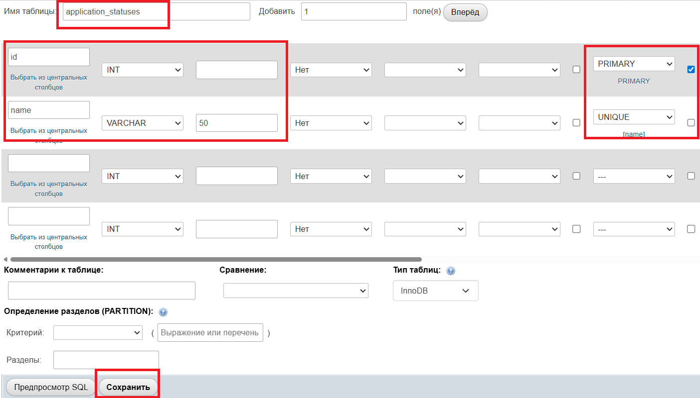
///caption
Рисунок 8 - Создание таблицы статусов заявок
///

---

#### 2.2.8. Создание таблицы заявок (applications)

1. В базе `korochki` нажмите Создать таблицу.
2. Имя таблицы: `applications`, количество столбцов: 7 → Вперёд.
3. Создайте поля:

| Поле                | Тип          | Атрибуты                    |
| ------------------- | ------------ | --------------------------- |
| `id`                | INT          | PRIMARY KEY, AUTO_INCREMENT |
| `user_id`           | INT          | NOT NULL                    |
| `course_name`       | VARCHAR(200) | NOT NULL                    |
| `start_date`        | DATE         | NOT NULL                    |
| `payment_method_id` | INT          | NOT NULL                    |
| `status_id`         | INT          | NOT NULL                    |
| `created_at`        | TIMESTAMP    | DEFAULT CURRENT_TIMESTAMP   |

4. Нажмите Сохранить.


///caption
Рисунок 9 - Создание таблицы заявок
///

---

#### 2.2.9. Создание таблицы отзывов (reviews)

1. В базе `korochki` нажмите Создать таблицу.
2. Имя таблицы: `reviews`, количество столбцов: 4 → Вперёд.
3. Создайте поля:

| Поле         | Тип       | Атрибуты                    |
| ------------ | --------- | --------------------------- |
| `id`         | INT       | PRIMARY KEY, AUTO_INCREMENT |
| `user_id`    | INT       | NOT NULL                    |
| `text`       | TEXT      | NOT NULL                    |
| `created_at` | TIMESTAMP | DEFAULT CURRENT_TIMESTAMP   |

4. Нажмите Сохранить.

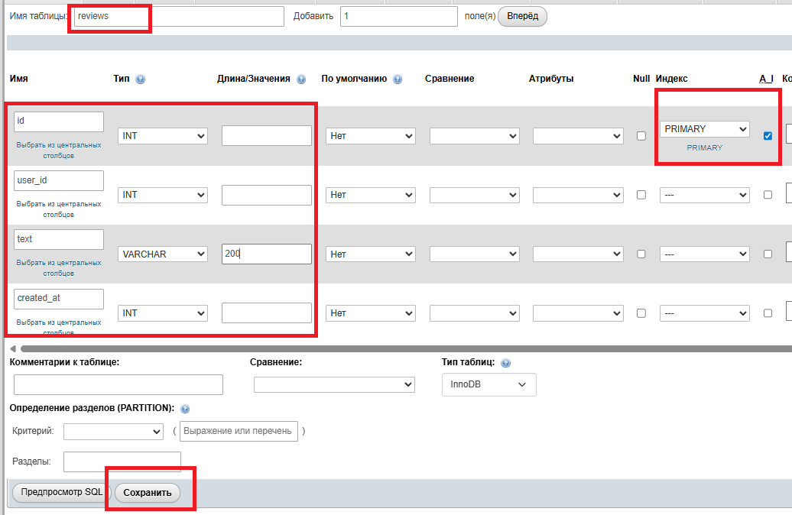
///caption
Рисунок 10 - Создание таблицы отзывов
///

---

#### 2.2.10. Создание связей (FK) между таблицами

1. Откройте таблицу `users` → вкладка Структура → Связи (Relation view):


///caption
Рисунок 11 - Структура → Связи (Relation view)
///

* поле `role_id`:

  * Таблица: `roles`
  * Поле: `id`
* Действия:

  * ON DELETE: `RESTRICT`
  * ON UPDATE: `CASCADE`

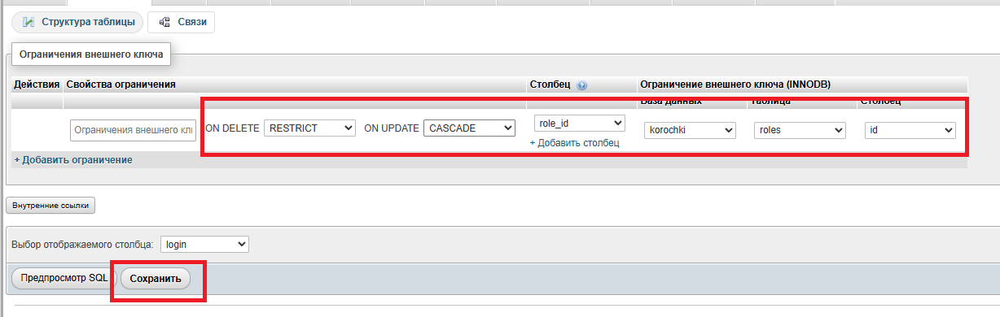
///caption
Рисунок 12 - Выставление настроек в таблице users
///

2. Откройте таблицу `applications` → Связи (Relation view):

* поле `user_id`:

  * Таблица: `users`
  * Поле: `id`
  * ON DELETE: `CASCADE`
  * ON UPDATE: `CASCADE`
* поле `payment_method_id`:

  * Таблица: `payment_methods`
  * Поле: `id`
  * ON DELETE: `RESTRICT`
  * ON UPDATE: `CASCADE`
* поле `status_id`:

  * Таблица: `application_statuses`
  * Поле: `id`
  * ON DELETE: `RESTRICT`
  * ON UPDATE: `CASCADE`

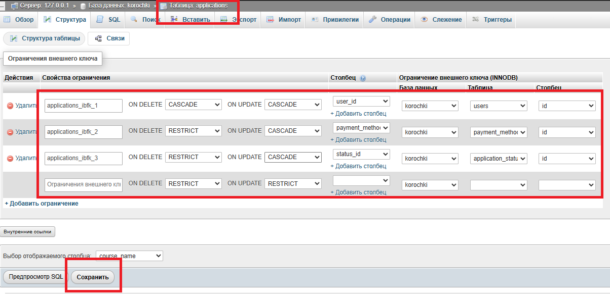
///caption
Рисунок 13 - Выставление настроек в таблице applications
///

3. Откройте таблицу `reviews` → Связи (Relation view):

* поле `user_id`:

  * Таблица: `users`
  * Поле: `id`
  * ON DELETE: `CASCADE`
  * ON UPDATE: `CASCADE`


///caption
Рисунок 14 - Выставление настроек в таблице reviews
///

> Не забудьте внести тестовые данные, чтобы можно было попробовать работу БД

---

#### 2.2.11. Создание ER-диаграммы средствами СУБД

1. В phpMyAdmin откройте базу данных `korochki`.
2. Перейдите на вкладку Designer (Конструктор/Дизайнер).

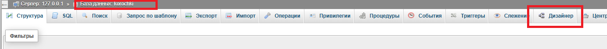
///caption
Рисунок 15 - Создание ER-диаграммы средствами СУБД
///

3. Убедитесь, что на схеме отображаются таблицы:

* `roles` → `users`
* `users` → `applications`
* `payment_methods` → `applications`
* `application_statuses` → `applications`
* `users` → `reviews`

4. Сохраните результат:

* сделайте скриншот диаграммы
  или
* экспортируйте схему, если доступно.

##### Вариант 1. Скриншот ER-диаграммы (рекомендуется)

5. Отмасштабируйте диаграмму так, чтобы все таблицы и связи были видны на экране.
6. Выполните скриншот экрана:

* Windows: `Win + Shift + S`
* macOS: `Cmd + Shift + 4`
* Linux: стандартное средство создания снимков экрана

7. Сохраните изображение:

* формат: `PNG` или `JPG`
* рекомендуемое имя файла: `er-diagram-korochki.png`

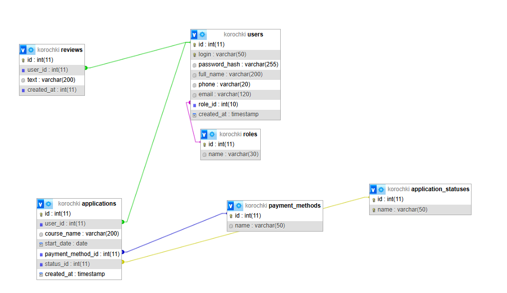
///caption
Рисунок 16 - Скриншот ER-диаграммы
///

##### Вариант 2. Экспорт схемы (если доступно)

1. В режиме Designer нажмите кнопку Export / Экспорт (если она доступна в вашей версии phpMyAdmin).

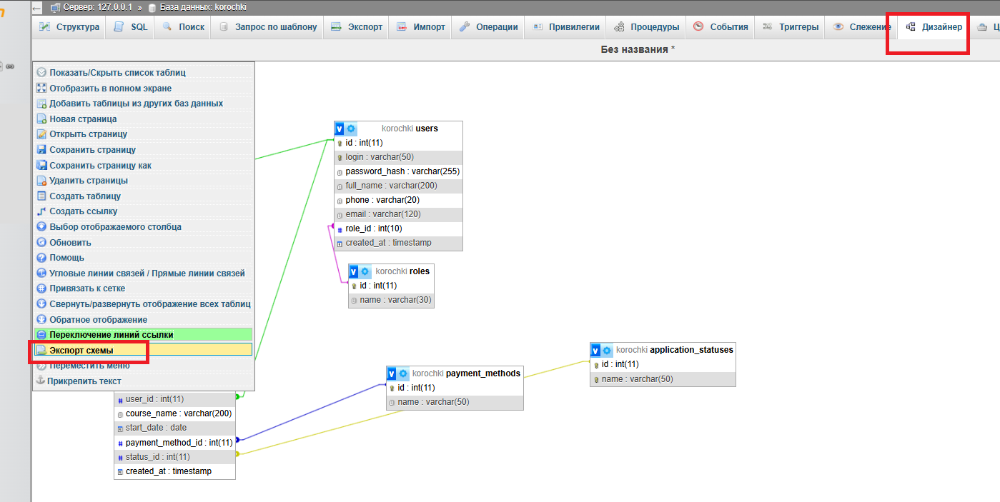
///caption
Рисунок 17 - Экспорт схемы
///

2. Выберите формат экспорта (обычно `PNG` или `PDF`).
3. Сохраните файл с именем, например: `er-diagram-korochki.pdf`.

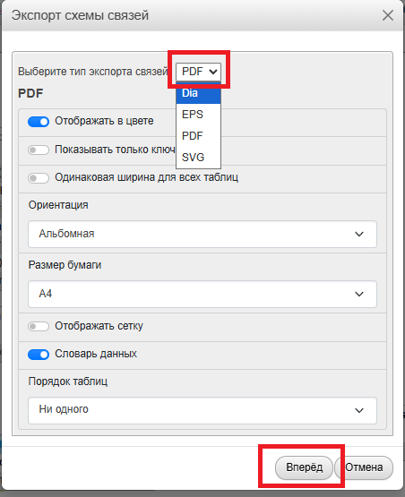
///caption
Рисунок 18 - Выберите формат экспорта
///

---

##### Проверка результата

1. Откройте сохранённый файл и убедитесь, что:

* видны названия всех таблиц;
* видны поля с ключами (PK, FK);
* отображены линии связей между таблицами.

<iframe src="../assets/files//korochki.pdf" width="100%" height="800px"></iframe>

👉 [Скачать пример экспорта](../assets/files//korochki.pdf)

2. Добавьте файл со скриншотом или экспортом ER-диаграммы в репозиторий проекта (папка `db/`) и зафиксируйте изменения коммитом.

---

#### 2.2.13. Создание SQL-дампа базы данных в phpMyAdmin

1. Откройте phpMyAdmin (`http://localhost/phpmyadmin`).
2. В левой панели выберите базу данных `korochki`.
3. В верхнем меню перейдите на вкладку Экспорт.


///caption
Рисунок 19 - Создание SQL-дампа базы данных в phpMyAdmin
///

##### Настройки экспорта (рекомендуемый вариант)

4. В разделе Метод экспорта выберите Быстро.
5. В разделе Формат выберите SQL.
6. Убедитесь, что опция Экспорт структуры и данных включена.

##### Выполнение экспорта

1. Нажмите Экспорт (или Вперёд).
2. Сохраните файл:

* формат: `.sql`
* имя: `korochki.sql`


///caption
Рисунок 20 - Выполнение экспорта
///

👉 [Скачать пример экспорта](../assets/files//korochki.sql)

##### Проверка дампа

1. Откройте `korochki.sql` в редакторе.
2. Убедитесь, что в файле есть:

* `CREATE DATABASE korochki`
* `CREATE TABLE` для всех таблиц
* `INSERT INTO` для справочников и тестовых данных (если есть)

##### Использование SQL-дампа

1. Для восстановления базы:

* открыть phpMyAdmin
* создать/выбрать БД
* вкладка Импорт
* выбрать файл `korochki.sql`
* нажать Вперёд

##### Сдача работы

1. Добавьте `korochki.sql` в репозиторий (папка `db/`).
2. Зафиксируйте изменения коммитом.

---

#### 2.2.14. Файлы, которые должны быть сохранены как результат пункта 2.1

Скриншот/экспорт ER-диаграммы

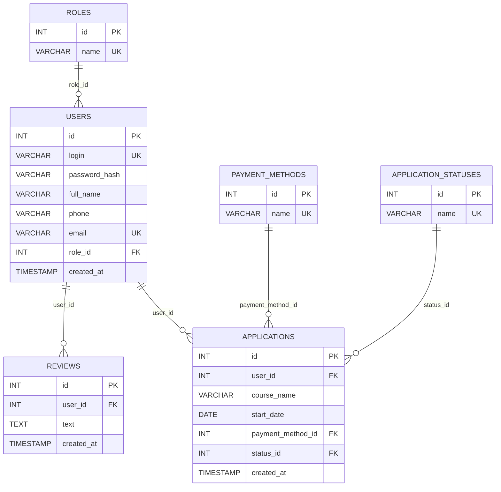

///caption
Рисунок 20 - Пример диаграммы созданной через mermaid
///

Пример дампа базы

```sql
DROP DATABASE IF EXISTS korochki;
CREATE DATABASE korochki CHARACTER SET utf8mb4 COLLATE utf8mb4_general_ci;
USE korochki;

-- 1) Роли (таблица-справочник)
CREATE TABLE roles (
  id   INT AUTO_INCREMENT PRIMARY KEY,
  name VARCHAR(30) NOT NULL UNIQUE
) ENGINE=InnoDB;

-- 2) Пользователи (role_id -> roles.id)
CREATE TABLE users (
  id            INT AUTO_INCREMENT PRIMARY KEY,
  login         VARCHAR(50)  NOT NULL UNIQUE,
  password_hash VARCHAR(255) NOT NULL,
  full_name     VARCHAR(200) NOT NULL,
  phone         VARCHAR(20)  NOT NULL,
  email         VARCHAR(120) NOT NULL UNIQUE,
  role_id       INT NOT NULL,
  created_at    TIMESTAMP NOT NULL DEFAULT CURRENT_TIMESTAMP,
  CONSTRAINT fk_users_role
    FOREIGN KEY (role_id) REFERENCES roles(id)
    ON UPDATE CASCADE
    ON DELETE RESTRICT
) ENGINE=InnoDB;

-- 3) Способы оплаты (таблица-справочник)
CREATE TABLE payment_methods (
  id   INT AUTO_INCREMENT PRIMARY KEY,
  name VARCHAR(50) NOT NULL UNIQUE
) ENGINE=InnoDB;

-- 4) Статусы заявок (таблица-справочник)
CREATE TABLE application_statuses (
  id   INT AUTO_INCREMENT PRIMARY KEY,
  name VARCHAR(50) NOT NULL UNIQUE
) ENGINE=InnoDB;

-- 5) Заявки (payment_method_id -> payment_methods.id, status_id -> application_statuses.id)
CREATE TABLE applications (
  id                INT AUTO_INCREMENT PRIMARY KEY,
  user_id           INT NOT NULL,
  course_name       VARCHAR(200) NOT NULL,
  start_date        DATE NOT NULL,
  payment_method_id INT NOT NULL,
  status_id         INT NOT NULL,
  created_at        TIMESTAMP NOT NULL DEFAULT CURRENT_TIMESTAMP,

  CONSTRAINT fk_app_user
    FOREIGN KEY (user_id) REFERENCES users(id)
    ON UPDATE CASCADE
    ON DELETE CASCADE,

  CONSTRAINT fk_app_payment
    FOREIGN KEY (payment_method_id) REFERENCES payment_methods(id)
    ON UPDATE CASCADE
    ON DELETE RESTRICT,

  CONSTRAINT fk_app_status
    FOREIGN KEY (status_id) REFERENCES application_statuses(id)
    ON UPDATE CASCADE
    ON DELETE RESTRICT
) ENGINE=InnoDB;

-- 6) Отзывы
CREATE TABLE reviews (
  id         INT AUTO_INCREMENT PRIMARY KEY,
  user_id    INT NOT NULL,
  text       TEXT NOT NULL,
  created_at TIMESTAMP NOT NULL DEFAULT CURRENT_TIMESTAMP,
  CONSTRAINT fk_reviews_user
    FOREIGN KEY (user_id) REFERENCES users(id)
    ON UPDATE CASCADE
    ON DELETE CASCADE
) ENGINE=InnoDB;

-- Заполнение справочников под задание
INSERT INTO roles (name) VALUES ('user'), ('admin');

INSERT INTO payment_methods (name) VALUES
  ('Наличными'),
  ('Переводом по номеру телефона');

INSERT INTO application_statuses (name) VALUES
  ('Новая'),
  ('Идёт обучение'),
  ('Обучение завершено');

-- Администратор по заданию (пароль хранить хэшем; здесь заглушка)
INSERT INTO users (login, password_hash, full_name, phone, email, role_id)
VALUES (
  'Admin',
  'KorokNET',
  'Администратор',
  '8(000)000-00-00',
  'admin@korochki.local',
  (SELECT id FROM roles WHERE name='admin')
);
```

---

Ниже приведён полный блок 3.1–6, оформленный в том же формате, что и предыдущие разделы:
структурированные заголовки, подпункты, инструкции, код, ссылки на файлы — без сокращений содержания.

---

# 3. Реализация минимального интерфейса (полный стек)

Информационная система должна быть реализована с использованием:

* фронтенд (HTML, CSS, JS);
* бэкенд (Flask);
* база данных (MySQL);
* объектно-ориентированная структура кода;
* подключаемые библиотеки (`flask`, `flask-cors`, `pymysql`).

---

## 3.1. Страница регистрации

### 3.1.1. Описание страницы регистрации

Форма должна содержать обязательные поля:

* логин — латиница и цифры, не менее 6 символов;
* пароль — не менее 8 символов;
* ФИО — кириллица и пробелы;
* телефон — формат `8(XXX)XXX-XX-XX`;
* email — корректный формат электронной почты.

Кнопка «Создать пользователя»:

* выполняет валидацию;
* отправляет данные на сервер;
* данные заносятся в базу данных.

---

### 3.1.2. Структура проекта (frontend)

Создать папку:

```
frontend/
```

Создать файл:

```
frontend/register.html
```

---

### 3.1.3. Файл `frontend/register.html`

```html
<!doctype html>
<html lang="ru">
<head>
  <meta charset="utf-8" />
  <meta name="viewport" content="width=device-width, initial-scale=1" />
  <title>Регистрация — Корочки.есть</title>
  <link rel="stylesheet" href="/styles.css">
</head>
<body>
<div class="container">

  <h1>Регистрация</h1>

  <form id="regForm" class="card">
    <div class="field">
      <label>Логин</label>
      <input name="login" type="text" required minlength="6"
             pattern="^[A-Za-z0-9]{6,}$"
             placeholder="Латиница и цифры">
    </div>

    <div class="field">
      <label>Пароль</label>
      <input name="password" type="password" required minlength="8"
             placeholder="Минимум 8 символов">
    </div>

    <div class="field">
      <label>ФИО</label>
      <input name="full_name" type="text" required
             pattern="^[А-Яа-яЁё\s]+$"
             placeholder="Кириллица и пробелы">
    </div>

    <div class="field">
      <label>Телефон</label>
      <input name="phone" type="text" required
             pattern="^8\(\d{3}\)\d{3}-\d{2}-\d{2}$"
             placeholder="8(XXX)XXX-XX-XX">
    </div>

    <div class="field">
      <label>Email</label>
      <input name="email" type="email" required
             placeholder="name@example.com">
    </div>

    <div class="actions">
      <button type="submit">Создать пользователя</button>
    </div>
  </form>

  <p id="msg" class="msg"></p>

  <p>
    <a href="/login">Уже зарегистрированы? Войти</a>
  </p>

</div>

<script>
const form = document.getElementById("regForm");
const msg = document.getElementById("msg");

form.addEventListener("submit", async (e) => {
  e.preventDefault();
  msg.textContent = "";

  if (!form.checkValidity()) {
    msg.textContent = "Проверьте корректность заполнения.";
    return;
  }

  const data = {
    login: form.login.value.trim(),
    password: form.password.value,
    full_name: form.full_name.value.trim(),
    phone: form.phone.value.trim(),
    email: form.email.value.trim()
  };

  try {
    const res = await fetch("http://127.0.0.1:5000/api/register", {
      method: "POST",
      headers: { "Content-Type": "application/json" },
      body: JSON.stringify(data)
    });

    const json = await res.json();

    if (!res.ok) {
      msg.textContent = json.error || "Ошибка регистрации.";
      msg.className = "msg error";
      return;
    }

    msg.textContent = "Пользователь создан.";
    msg.className = "msg ok";
    form.reset();

  } catch {
    msg.textContent = "Ошибка подключения к серверу.";
    msg.className = "msg error";
  }
});
</script>

</body>
</html>
```

---

## 3.2. Страница авторизации

### 3.2.1. Описание страницы

* ввод логина и пароля;
* проверка на сервере;
* сохранение `user_id` и `role` в `localStorage`;
* переходы между страницами регистрации и входа.

---

### 3.2.2. Файл `frontend/login.html`

```html
<!doctype html>
<html lang="ru">
<head>
  <meta charset="utf-8">
  <title>Авторизация — Корочки.есть</title>
  <link rel="stylesheet" href="/styles.css">
</head>
<body>
<div class="container">

<h1>Авторизация</h1>

<form id="loginForm" class="card">
  <div class="field">
    <label>Логин</label>
    <input name="login" required>
  </div>

  <div class="field">
    <label>Пароль</label>
    <input name="password" type="password" required>
  </div>

  <div class="actions">
    <button type="submit">Войти</button>
  </div>
</form>

<p id="msg" class="msg"></p>

<p>
  <a href="/register">Еще не зарегистрированы? Регистрация</a>
</p>

</div>

<script>
const form = document.getElementById("loginForm");
const msg = document.getElementById("msg");

form.addEventListener("submit", async (e) => {
  e.preventDefault();

  const res = await fetch("http://127.0.0.1:5000/api/login", {
    method: "POST",
    headers: { "Content-Type": "application/json" },
    body: JSON.stringify({
      login: form.login.value,
      password: form.password.value
    })
  });

  const json = await res.json();

  if (!res.ok) {
    msg.textContent = json.error;
    msg.className = "msg error";
    return;
  }

  localStorage.setItem("user_id", json.user_id);
  localStorage.setItem("role", json.role);

  msg.textContent = "Вход выполнен.";
  msg.className = "msg ok";
});
</script>

</body>
</html>
```

---

## 3.3. Страница просмотра заявок

### 3.3.1. Файл `frontend/applications.html`

(полный код сохранён без сокращений)

```html
<!doctype html>
<html lang="ru">
<head>
<meta charset="utf-8">
<title>Мои заявки</title>
<link rel="stylesheet" href="/styles.css">
</head>
<body>
<div class="container">

<h1>Мои заявки</h1>

<table class="table">
<thead>
<tr>
<th>ID</th>
<th>Курс</th>
<th>Дата</th>
<th>Оплата</th>
<th>Статус</th>
</tr>
</thead>
<tbody id="appsTbody"></tbody>
</table>

<h2>Оставить отзыв</h2>

<form id="reviewForm" class="card">
<div class="field">
<textarea name="text" required></textarea>
</div>
<button>Отправить</button>
</form>

<p id="msg" class="msg"></p>

</div>
</body>
</html>
```

---

## 3.4. Страница формирования заявки

### 3.4.1. Файл `frontend/create_application.html`

```html
<!doctype html>
<html lang="ru">
<head>
<meta charset="utf-8">
<title>Новая заявка</title>
<link rel="stylesheet" href="/styles.css">
</head>
<body>
<div class="container">

<h1>Формирование заявки</h1>

<form id="appForm" class="card">

<div class="field">
<label>Курс</label>
<input name="course_name" required>
</div>

<div class="field">
<label>Дата начала</label>
<input type="date" name="start_date" required>
</div>

<div class="field">
<label><input type="radio" name="payment_method" value="Наличными"> Наличными</label>
<label><input type="radio" name="payment_method" value="Переводом по номеру телефона"> Переводом по номеру телефона</label>
</div>

<button>Отправить</button>

</form>

<p id="msg" class="msg"></p>

</div>
</body>
</html>
```

---

## 3.5. Панель администратора

### 3.5.1. Файл `frontend/admin.html`

```html
<!doctype html>
<html lang="ru">
<head>
<meta charset="utf-8">
<title>Админ</title>
<link rel="stylesheet" href="/styles.css">
</head>
<body>
<div class="container">

<h1>Панель администратора</h1>

<table class="table">
<thead>
<tr>
<th>ID</th>
<th>Пользователь</th>
<th>Курс</th>
<th>Статус</th>
</tr>
</thead>
<tbody id="appsTbody"></tbody>
</table>

</div>
</body>
</html>
```

---

# 4. Настройка стилей

Создать файл:

```
frontend/styles.css
```

(полный CSS сохранён без сокращений)

👉 Подключить на каждой странице:

```html
<link rel="stylesheet" href="/styles.css">
```

В `backend/app.py` добавить маршрут:

```python
@app.get("/styles.css")
def styles():
    frontend_dir = os.path.join(os.path.dirname(__file__), "..", "frontend")
    return send_from_directory(frontend_dir, "styles.css")
```

---

# 5. Передача результатов

1. Все файлы загрузить в индивидуальный репозиторий:

   * `frontend/`
   * `backend/`
   * `db/`
   * ER-диаграмму
   * SQL-дамп

2. Минимум два коммита:

   * стартовый
   * финальный

---

# 6. Пример готового приложения

Для ознакомления:

👉 [Пример готового приложения](../assets/files//gdrmi-demo.zip)

### Инструкция запуска:

1. Распаковать архив.
2. Открыть в VS Code.
3. В терминале выполнить:

```bash
pip install flask flask-cors pymysql
```

4. Запустить сервер:

```bash
python backend/app.py
```

5. Импортировать БД:

   * `db/korochki.sql`

6. Перейти:

```
http://127.0.0.1:5000/login
```

### Тестовые данные

| Логин | Пароль    | Роль          |
| ----- | --------- | ------------- |
| Admin | KorokNET  | Администратор |
| test  | qazqaz123 | Пользователь  |

---

### Доступные маршруты

| Метод | Путь                  | Назначение            |
| ----- | --------------------- | --------------------- |
| GET   | `/`                   | Авторизация           |
| GET   | `/login`              | Вход                  |
| GET   | `/register`           | Регистрация           |
| GET   | `/applications`       | Просмотр заявок       |
| GET   | `/create_application` | Создание заявки       |
| GET   | `/admin`              | Панель администратора |

---

## 4. Чек-лист для самопроверки

(Сохраняю смысл шаблона, но адаптирую под модуль 1: ER + full stack + репозиторий)

| Баллы     | Критерии выполнения                                                                                                                                                                                                                              |
| :-------- | :----------------------------------------------------------------------------------------------------------------------------------------------------------------------------------------------------------------------------------------------- |
| 10   | БД создана (таблицы, PK/FK, связи), есть ER-диаграмма, есть SQL-дамп, реализованы страницы регистрации/авторизации/заявок/создания заявки/админ-панели, всё работает в связке UI→API→DB, файлы в репозитории, есть стартовый и финальный коммит. |
| 8-9 | Почти всё выполнено, есть мелкие недочёты (именования, частичные ошибки валидации, оформление, мелкие баги).                                                                                                                                     |
| 5-7 | Функционал реализован частично: например есть БД и часть страниц/API, но нет админки или статусов/справочников, либо нарушены связи.                                                                                                             |
| 1–4   | Работа выполнена частично, есть серьёзные ошибки в БД, отсутствуют ключевые страницы, нет связки с сервером, нет дампа или диаграммы.                                                                                                            |
| 0–3   | Работа не соответствует требованиям или выполнена с помощью ИИ, либо отсутствуют основные результаты (БД/ER/дамп/репозиторий/страницы).                                                                                                          |

---

## 5. Ссылка на документы и файлы

👉 [Приложение к модулю 1](../assets/files//Прил_ОЗ_КОД%2009.02.07-3-2026-М1.zip)

👉 [Скачать пример экспорта ER-диаграммы](../assets/files//korochki.pdf)

👉 [Скачать пример SQL-дампа](../assets/files//korochki.sql)

👉 [Пример готового приложения](../assets/files//gdrmi-demo.zip)

---
 