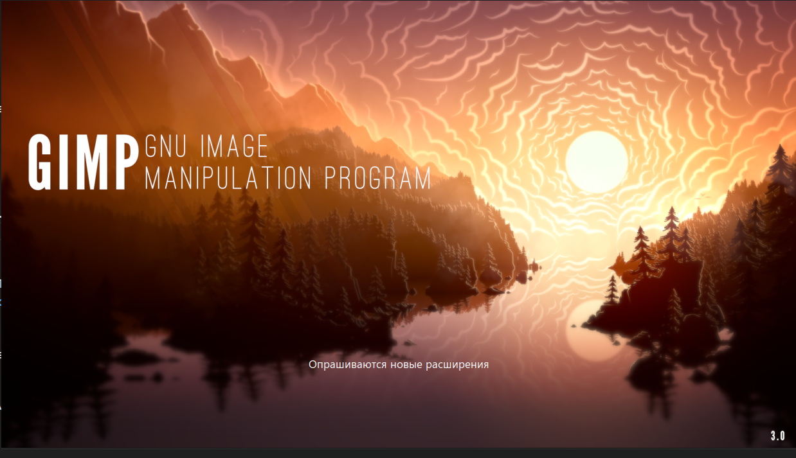
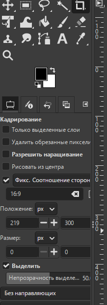
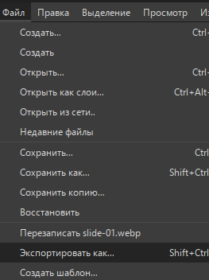
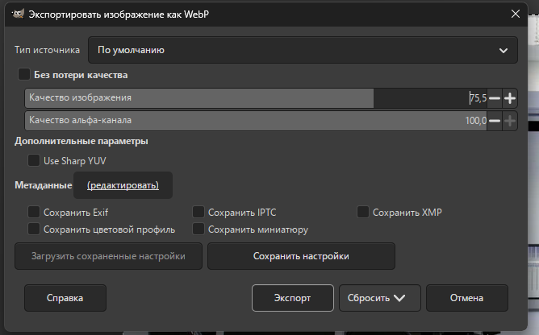

# Лабораторная работа №2. Проектирование технического проекта на основе документов заказчика

### Модуль 2. Разработка дизайна веб-приложений

---

### 1. Теория

### Общие требования

В данном модуле необходимо уделить **особое внимание дизайну**. Обучающемуся предоставляются изображения, которые требуется **оптимизировать и улучшить** с целью достижения основной задачи — **создания качественной и удобной информационной системы**.

Разместите изображения, иконки, поля форм, кнопки, ссылки и иные графические элементы таким образом, чтобы они **гармонично дополняли приложение** и обеспечивали удобство использования.

Для повышения качества графической подсистемы необходимо применять **библиотеки и фреймворки**, изученные в рамках дисциплины.

---

### Требования к адаптивности и представлению дизайна

Необходимо разработать **дизайн всех страниц** информационной системы с учётом использования на смартфоне с разрешением:

**390 × 844 px**

Допускается представление дизайна:

* в виде `.html`-файлов;
* отдельный файл — для каждой страницы приложения.

---

### Дополнительные требования к интерфейсу

Заказчик предъявляет дополнительное требование — наличие **слайдера изображений**, который:

* автоматически переключает изображения каждые **3 секунды**;
* содержит **4 изображения одинакового размера**;
* имеет элементы управления **«вперёд / назад»**;
* органично вписан в общий дизайн приложения.

---

### Требования к сдаче практической работы

Все практические результаты должны быть переданы путём загрузки файлов в индивидуальный репозиторий системы контроля версий.

Необходимо выполнить коммиты:

* в начале выполнения работы;
* в завершении выполнения модуля.

---

### Необходимые приложения

* `Прил_ОЗ_КОД 09.02.07-3-2026-М2.zip`

👉 [Приложение к модулю 2](assets/files//Прил_ОЗ_КОД%2009.02.07-3-2026-М2.zip)

---

## 2. Задание

## Модуль 2. Разработка дизайна веб-приложений — Пошаговое выполнение задания

---

## 1. Подготовка изображений

---

### 1.1. Создать папку для изображений в проекте

##### 1.1.1. Создание папки

1. Открыть папку проекта.
2. Перейти в каталог `frontend/`.
3. Создать внутри `frontend` папки:

```
assets
media
```

Итоговый путь:

```
frontend/assets/media/
```

---

### 1.2. Распаковать архив с изображениями

Архив: `Прил_ОЗ_КОД 09.02.07-3-2026-М2.zip`

1. Найти архив.
2. Выполнить **Извлечь все / Extract**.
3. Выбрать папку для распаковки.

После распаковки должна появиться папка `media/` с файлами `image01…image18`.

---

### 1.3. Подготовка изображений в GIMP

##### 1.3.1. Запуск GIMP


///caption
Рисунок 1 — Запуск GIMP
///

---

##### 1.3.2. Открытие изображения


///caption
Рисунок 2 — Открытие изображения в GIMP
///

---

##### 1.3.3. Кадрирование под 16:9

1. Выбрать инструмент **Кадрирование**.
2. Включить режим **Соотношение сторон (Aspect ratio)**.
3. Указать `16:9`.


///caption
Рисунок 3 — Инструмент «Кадрирование»
///


///caption
Рисунок 4 — Кадрирование изображения под 16:9
///

---

##### 1.3.4. Масштабирование изображения

1. Выбрать `Изображение → Масштабировать изображение`.
2. Установить размер:

* 1024 × 576


///caption
Рисунок 5 — Масштабирование изображения
///

---

##### 1.3.5. Экспорт в WebP

1. Выбрать `Файл → Экспортировать как`.


///caption
Рисунок 6 — Команда «Экспортировать как»
///

2. Установить качество 75–85.


///caption
Рисунок 7 — Параметры экспорта WebP
///

Сохранить файлы:

```
slide-01.webp
slide-02.webp
slide-03.webp
slide-04.webp
```

в папку:

```
frontend/assets/media/slider/
```

---

## 2. Адаптивный дизайн (mobile-first)

---

### 2.1. Проверка адаптивности

1. Открыть DevTools.
2. Включить режим устройства.
3. Установить **390 × 844 px**.
4. Проверить:

   * отсутствие горизонтальной прокрутки;
   * корректность отступов;
   * удобство кнопок (≥ 44px).

---

## 3. Реализация слайдера

---

### 3.1. HTML-разметка

```html
<div class="slider" id="slider">
  <div class="slides">
    
    
    
    
  </div>

  <button class="slider-btn prev">&##10094;</button>
  <button class="slider-btn next">&##10095;</button>
</div>
```

---

### 3.2. Подключение маршрутов в Flask

```python
@app.get("/assets/<path:filepath>")
def assets(filepath):
    return send_from_directory(os.path.join(FRONTEND_DIR, "assets"), filepath)

@app.get("/slider.js")
def slider_js():
    return send_from_directory(FRONTEND_DIR, "slider.js")
```

---

### 3.3. JavaScript (автопрокрутка 3 секунды)

Файл: `frontend/slider.js`

(код оставляем из предыдущей версии — без сокращений)

---

## 4. Оформление форм

---

### 4.1. Валидация на странице регистрации

Ошибки должны:

* отображаться непосредственно на форме;
* подсвечивать поля (`.is-error`);
* отображать сообщение пользователю.

---

## 5. Страница формирования заявки

Поле выбора курса:

```html
<select>
  <option>Основы алгоритмизации и программирования</option>
  <option>Основы веб-дизайна</option>
  <option>Основы проектирования баз данных</option>
</select>
```

Поле даты:

```
ДД.ММ.ГГГГ
```

---

## 6. Ограничение доступа к отзыву

Форма отзыва доступна **только после статуса**:

```
Обучение завершено
```

Использовать блокировку через JS и визуальное пояснение.

---

## 7. Улучшение панели администратора

Добавить:

* фильтрацию
* пагинацию
* toast-уведомления

(код реализуется аналогично предыдущей версии)

---

## 8. Сдача работы

---

### 8.1. Первый коммит

```bash
git add .
git commit -m "Начало модуля 2"
git push
```

---

### 8.2. Финальный коммит

```bash
git add .
git commit -m "Завершение модуля 2"
git push
```

---

## 9. Пример готового приложения

👉 [Пример готового приложения](assets/files//gdrmi-demo-m2.zip)

---

## 10. Чек-лист оценки (10 баллов)

| Баллы | Критерии                                                                                                                                                                                    |
| ----- | ------------------------------------------------------------------------------------------------------------------------------------------------------------------------------------------- |
| 10    | Выполнены все требования: подготовка 4 изображений, mobile-first, слайдер (3 сек), формы с валидацией, select + ДД.ММ.ГГГГ, ограничение отзыва, админка с фильтрами и пагинацией, 2 коммита |
| 8–9   | Есть мелкие недочёты дизайна или адаптивности                                                                                                                                               |
| 5–7   | Частично выполнен функционал                                                                                                                                                                |
| 1–4   | Выполнена небольшая часть требований                                                                                                                                                        |
| 0     | Работа выполнена полностью или частично с использованием систем искусственного интеллекта либо не соответствует требованиям                                                                 |

 